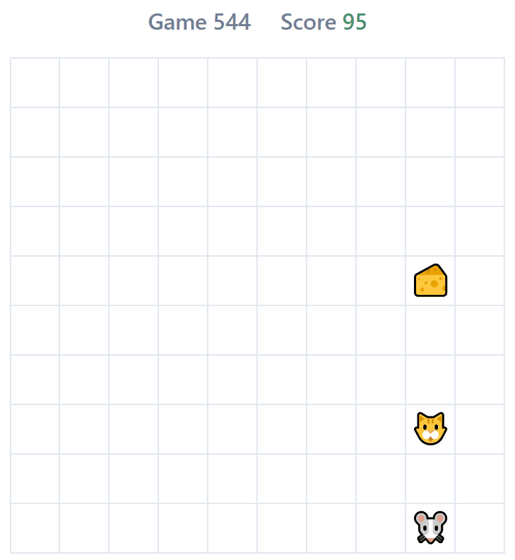

# Catch the Cheese
In this game mouse itself learns how to avoid cat and collect cheeses on the game field via **Q-Learning** algorithm by exploring all possible situations and getting either rewards or punishments.

<p align="center">
	
</p>

This game uses:
- **TensorFlow.js** for machine learning in JavaScript
- **Vue.js** as engine for game logic and rendering

The code is well commented but requires initial knowledge of Reinforcement Learning. 

## Prerequisites

- NPM
- Node.js

#### Optional:

- Chrome Browser
- Visual Studio Code
- Visual Studio Code Extensions:
  - Debugger for Chrome
  - Vetur

## Installing
```
npm install
```

## How to Run

### Compiles and hot-reloads for development
```
npm run serve
```
The command starts  dev server at http://localhost:8080/.
> `F5` in Visual Studio Code opens up http://localhost:8080/ in chrome browser.

### Compiles and minifies for production
```
npm run build
```
Compiles project into `/dist` folder